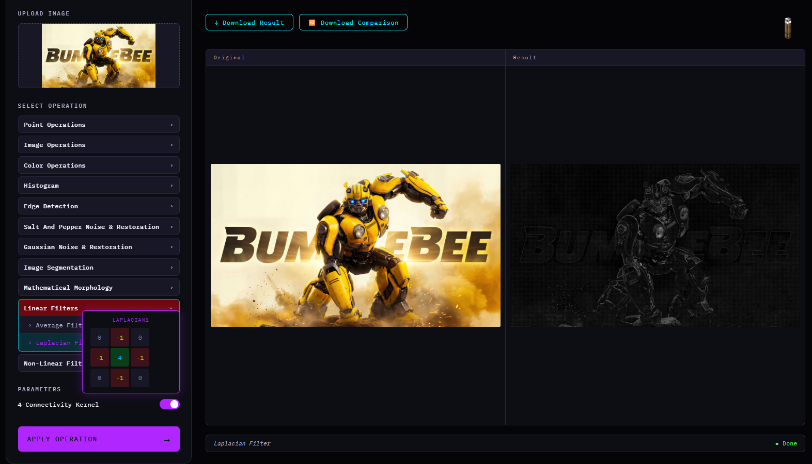
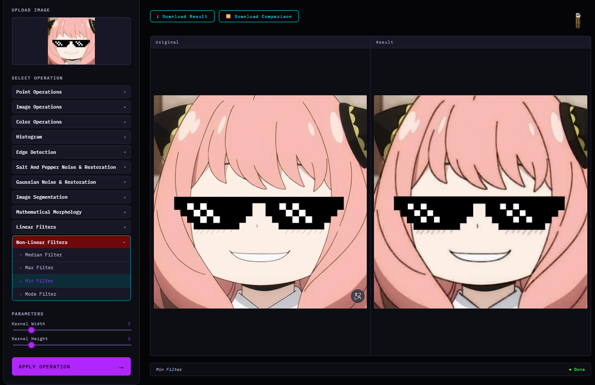

# Digital Image Processing Project
This project is a web application designed to apply various image processing tasks.
It uses Python (Flask) in the backend, HTML, CSS, and JavaScript in the frontend, and implements functionality using Python libraries such as NumPy and OpenCV. It also uses C++ to implement custom functions and improve performance, keeping the code fast and efficient.


## For Setup On Windows:

### Prerequisites:
#### Make sure you have installed:
- Python 3.10+
- pip
- C++ compiler (g++ / clang++)

### 1. Create The Virtual Environment(Optional but recommended):
Run this in terminal:
```bash
python -m venv venv
```
Then activate it:
```bash
venv\Scripts\activate
```
### 2. Install All Requirements:
Run this in terminal:
```bash
pip install -r requirements.txt
```
### 3. Run The Backend:
Run this in terminal:
```bash
python app.py
```
### 4. Open The Application:
Open your browser and go to: http://localhost:5000


## On Other Operating Systems:
You may encounter issues because the shared library file differs between operating systems. On Windows the shared library extension is `.dll`, on Linux `.so`, and on macOS `.dylib`.
You can fix this by running the following command inside the `modules` folder:
### in Linux:
```bash
g++ -fPIC -shared help.cpp -o help.so
```
Then, update your Python code inside the modules files:
```python
self.p = ctypes.CDLL(os.path.join(os.path.dirname(os.path.abspath(__file__)), "help.dll"))
```
To:
```python
self.p = ctypes.CDLL(os.path.join(os.path.dirname(os.path.abspath(__file__)), "help.so"))
```
### in MacOS:
```bash
clang++ -std=c++17 -dynamiclib help.cpp -o help.dylib
```
Then, update your Python code inside the modules files:
```python
self.p = ctypes.CDLL(os.path.join(os.path.dirname(os.path.abspath(__file__)), "help.dll"))
```
To:
```python
self.p = ctypes.CDLL(os.path.join(os.path.dirname(os.path.abspath(__file__)), "help.dylib"))
```
*Finally, you can delete help.dll since it is not needed on this operating system.*

## Operations:

### Arithmetic Operations:
#### These operations modify pixel intensity values using basic mathematical transformations.
- **Addition**: Increases image brightness by adding a constant to each pixel.
- **Subtraction**: Decreases image brightness.
- **Multiplication**: Scales pixel intensities to enhance brightness.
- **Division**: Reduces pixel intensities.
- **Complement**: Produces the negative version of the image.
#### Code Concepts
- **Point Processing**: Each pixel is processed independently without considering neighboring pixels, meaning the operation on one pixel does not affect others.
- **NumPy Array Operations**: NumPy enables efficient vectorized operations on the entire image array, avoiding explicit loops and improving performance.
- **Data Type Conversion (`int16`, `float32`)**: Pixel values are converted to larger numeric types before arithmetic operations to prevent overflow or underflow during calculations.
- **Pixel Value Clipping (0–255)**: After processing, pixel values are limited to the valid image intensity range `[0, 255]` to ensure proper image representation.
#### *Example*


### Image Arithmetic Operations:
#### These operations apply arithmetic transformations between two images on a pixel-by-pixel basis. If the input images have different dimensions, the second image is automatically resized to match the first image.
- **Addition**: Combines two images by adding corresponding pixel values.
- **Subtraction**: Computes the difference between two images.
- **Multiplication**: Enhances or suppresses regions based on pixel interaction.
- **Division**: Highlights intensity differences between images.
- **Complement**: Produces the negative version of the image.
#### Code Concepts
- **Image Resizing**: Before applying operations, both images must have the same dimensions. If sizes differ, one image is resized using OpenCV to match the other.
- **Pixel-wise Operations**: Arithmetic operations are applied to corresponding pixels from both images independently.
- **NumPy Vectorization**: Operations are performed on full arrays using NumPy, improving efficiency compared to manual loops.
- **Data Type Conversion (`int16`, `float32`)**: Images are converted to larger numeric types before arithmetic calculations to avoid overflow and underflow.
- **Division Safety**: Zero-valued pixels in the divisor image are replaced to prevent division-by-zero errors.
- **Pixel Value Clipping (0–255)**: Output values are constrained to the valid intensity range for proper image display.
#### *Example*


### Color Channel Operations:
#### These operations manipulate individual color channels of an RGB image to modify color composition and visualize channel contributions.
- **Change Channel Value**: Sets all pixel values of a selected color channel to a constant value.
- **Swap Channels**: Exchanges two color channels (e.g., Red ↔ Blue).
- **Eliminate Channel**: Removes a channel by setting all its values to zero.
#### Code Concepts
- **Color Channel Manipulation**: Images are represented as multi-dimensional arrays where each channel corresponds to a color component (such as Blue, Green, and Red).
- **Channel Indexing**: Specific color channels are accessed using array indexing (`image[:,:,i]`) for direct modification.
- **Array Copying**: A copy of the original image is created before applying changes to preserve the original data.
- **Channel Reordering**: Swapping channels changes how color information is mapped, producing different color combinations.
#### *Example*


### Histogram Operations:
#### Histogram-based operations are used to analyze and enhance image contrast by redistributing intensity values.
- **Histogram Stretching**: Expands the intensity range of an image to improve contrast.
- **Histogram Equalization**: Redistributes intensity values to produce a more uniform histogram and reveal hidden details.
#### Code Concepts
- **Contrast Enhancement**: Both techniques improve visibility by increasing the distinction between dark and bright regions.
- **Min-Max Normalization**: Histogram stretching uses minimum and maximum intensity values to linearly scale pixel values across the full intensity range.
- **Grayscale Conversion**: Images can be converted to grayscale when processing intensity values without considering color information.
- **Channel-wise Processing**: For color images, each channel can be processed separately or selectively depending on the operation.
- **HSV Color Space**: During color histogram equalization, the image is converted to HSV space so only the **Value (brightness)** channel is modified while preserving color information.
- **OpenCV Histogram Equalization**: Uses OpenCV’s built-in histogram equalization function for efficient contrast redistribution.
- **Pixel Value Clipping**: Final values are constrained to the valid intensity range `[0, 255]`.
#### *Example*


### Edge Detection Operations:
#### Edge detection is used to identify object boundaries and significant intensity changes in an image. These operations convert the image to grayscale and compute intensity gradients to highlight edges.
- **Sobel Operator**: Uses two 3×3 convolution kernels to compute horizontal and vertical gradients. It detects edges while providing slight smoothing, which helps reduce noise sensitivity.
- **Prewitt Operator**: Similar to Sobel, but uses simpler kernels with uniform weights. It estimates edge direction and magnitude based on intensity changes between neighboring pixels.
- **Roberts Operator**: Uses 2×2 kernels to compute diagonal gradients. It is computationally lightweight and detects sharp edges, but is more sensitive to noise.
#### Code Concepts
- **Edge Detection**: Edge detection identifies regions with significant intensity changes, which usually correspond to object boundaries.
- **Grayscale Conversion**: Images are converted to grayscale before processing since edge detection relies on intensity variation rather than color information.
- **Gradient Calculation**: Horizontal and vertical gradients are computed separately, then combined using gradient magnitude calculation: `sqrt(Gx² + Gy²)`
- **Convolution Kernels**: Each operator applies specific kernels (filters) to measure intensity changes in different directions.
- **Sobel Filtering with OpenCV**: The Sobel operator uses optimized OpenCV functions for efficient gradient computation.
- **Manual Kernel Implementation**: Prewitt and Roberts operators are manually implemented using custom convolution logic.
- **Python–C Integration (`ctypes`)**: Computationally intensive operations are offloaded to C/C++ functions stored in a DLL and called from Python using `ctypes`.
- **Memory Pointer Handling**: Image arrays are converted into contiguous memory blocks and passed as raw pointers to native C functions for faster processing.
- **Performance Optimization**: Using C/C++ for pixel-level operations significantly reduces execution time compared to pure Python loops.
- **Pixel Value Clipping**: Edge magnitudes are clipped to the valid intensity range `[0, 255]`.
#### *Example*


### Salt-and-Pepper Noise Processing:
#### Salt-and-pepper noise is a type of impulse noise where random pixels are replaced with extreme intensity values (black or white). This module supports adding noise artificially and applying different filtering techniques for noise removal.
- **Salt-and-Pepper Noise Addition**: Randomly replaces selected pixels with white (salt) or black (pepper) values to simulate impulse noise.
- **Outlier Filter**: Compares each pixel with the mean of its neighboring pixels. If the difference exceeds a threshold, the pixel is replaced by the local mean.
- **Average Filter**: Applies a mean kernel over neighboring pixels to smooth noise by averaging intensities.
- **Median Filter**: Replaces each pixel with the median value of its neighborhood. This is highly effective for salt-and-pepper noise because it removes outliers while preserving edges.
#### Code Concepts
- **Noise Simulation**: Salt-and-pepper noise is generated by randomly selecting pixel positions and setting them to either minimum intensity (black) or maximum intensity (white).
- **Random Pixel Sampling**: Random coordinates are generated using NumPy to distribute noise across the image.
- **Spatial Filtering**: Noise reduction is performed using neighboring pixels inside a sliding kernel window.
- **Kernel-based Processing**: Filters use kernels (windows) such as 3×3 or larger to analyze local pixel neighborhoods.
- **Local Mean Calculation**: The outlier filter computes the average of surrounding pixels to identify abnormal intensity values.
- **Threshold-based Detection**: Pixels are classified as noisy when their intensity differs from the local mean by more than a specified threshold.
- **Linear Filtering**: The average filter performs smoothing using convolution with a normalized kernel.
- **Non-linear Filtering**: Median filtering uses rank-based processing instead of averaging, making it more robust against impulse noise.
- **Edge Preservation**: Median and outlier filters reduce noise while preserving important image boundaries better than average filtering.
#### *Example*


### Gaussian Noise Processing:
#### Gaussian noise is a statistical noise model where pixel intensity values are disturbed by values sampled from a normal (Gaussian) distribution. This module supports adding Gaussian noise and applying noise reduction techniques.
- **Gaussian Noise Addition**: Adds random values sampled from a normal distribution with configurable mean and standard deviation.
- **Average Filter**: Reduces Gaussian noise by smoothing local intensity variations using neighborhood averaging.
- **Image Averaging**: Averages multiple noisy versions of the same image. Random noise tends to cancel out, improving image quality.
#### Code Concepts
- **Gaussian Distribution**: Noise values are generated using a normal distribution characterized by a mean and standard deviation.
- **Random Noise Generation**: NumPy is used to generate random noise values matching the image dimensions.
- **Additive Noise Model**: Gaussian noise is added directly to pixel intensity values to simulate real-world sensor noise.
- **Statistical Parameters**: The **mean** controls noise bias, while the **standard deviation** controls noise strength.
- **Linear Smoothing**: Average filtering reduces noise by replacing each pixel with the mean of neighboring pixels.
- **Kernel-based Filtering**: A normalized kernel is used to perform convolution for smoothing.
- **Image Averaging Technique**: Multiple noisy images are averaged together, causing random noise to cancel out while preserving original image information.
- **Noise Reduction by Averaging**: Increasing the number of averaged images improves noise suppression due to statistical cancellation.
- **Pixel Value Clipping**: Pixel intensities are constrained to the valid range `[0, 255]`.
#### *Example*


### Thresholding Operations:
#### Thresholding is a segmentation technique used to separate foreground objects from the background by converting grayscale images into binary images.
- **Global Thresholding**: Uses a single threshold value for the entire image. Pixels above the threshold become white, while others become black.
- **Adaptive Thresholding**: Computes a local threshold for each neighborhood, making it effective for images with uneven illumination.
- **Automatic Thresholding**: Iteratively estimates the optimal threshold by partitioning pixels into two groups and updating the threshold using their mean intensities.
#### Code Concepts
- **Image Segmentation**: Thresholding separates important objects (foreground) from the background for easier analysis.
- **Grayscale Conversion**: Images are converted to grayscale since thresholding relies only on intensity values.
- **Binary Image Generation**: Pixels are classified into two groups: values above threshold become white (255), while lower values become black (0).
- **Global Threshold Selection**: A single threshold value is applied uniformly across the entire image.
- **Adaptive Thresholding**: Threshold values are computed locally for each neighborhood, making the method robust against non-uniform lighting.
- **Gaussian-weighted Neighborhood**: Adaptive thresholding uses weighted neighboring pixels, giving more importance to closer pixels.
- **Iterative Threshold Estimation**: Automatic thresholding repeatedly divides pixels into two groups, computes their means, and updates the threshold until convergence.
- **Convergence Criterion**: Iteration stops when threshold changes become smaller than a specified tolerance (`delta`) or when the maximum iteration count is reached.
#### *Example*


### Morphological Operations:
#### Morphological operations are shape-based image processing techniques applied to binary images. They are commonly used for object refinement, noise removal, boundary extraction, and shape analysis.
- **Dilation**: Expands foreground regions by adding pixels to object boundaries, helping fill small holes and connect nearby objects.
- **Erosion**: Shrinks foreground regions by removing boundary pixels, useful for eliminating small noise.
- **Opening**: Applies erosion followed by dilation. It removes small noise while preserving larger structures.
- **Closing**: Applies dilation followed by erosion. It fills small holes and gaps inside objects.
- **Internal Boundary**: Extracts object boundaries from inside the object using: Internal Boundary = Original − Erosion
- **External Boundary**: Extracts outer boundaries using: External Boundary = Dilation − Original
- **Morphological Gradient**: Highlights full object boundaries using: Gradient = Dilation − Erosion
#### Code Concepts
- **Binary Image Processing**: Morphological operations are typically applied to binary images where foreground and background are clearly separated.
- **Image Segmentation Integration**: The image is first converted into a binary representation using thresholding before morphology is applied.
- **Structuring Element (Kernel)**: A kernel defines the neighborhood shape and size used to transform object boundaries.
- **Shape Transformation**: Morphological operations alter object geometry to improve segmentation quality or emphasize structural features.
- **Boundary Extraction**: Internal, external, and gradient operations are used to isolate object contours and edges.
- **Noise Removal**: Opening removes small isolated noise regions from the image.
- **Hole Filling**: Closing fills small gaps or holes inside foreground objects.
- **Sequential Morphological Processing**: More complex operations such as opening and closing are built by combining basic dilation and erosion.
#### *Example*


### Linear Filtering Operations:
#### Linear filtering applies convolution kernels to an image in order to smooth noise or enhance important image features such as edges.
- **Average Filter**: Smooths the image by replacing each pixel with the average value of its neighboring pixels. It reduces noise but may blur edges and fine details.
- **Laplacian Filter**: Uses the second derivative to detect rapid intensity changes, making it effective for edge enhancement and sharpening.
#### Code Concepts
- **Linear Filtering**: Output pixel values are computed as weighted sums of neighboring pixels using convolution kernels.
- **Convolution Operation**: A kernel slides across the image and performs element-wise multiplication followed by summation.
- **Kernel-based Smoothing**: The average filter uses a normalized kernel where all weights are equal, producing uniform smoothing.
- **Second-order Derivatives**: The Laplacian filter measures intensity changes in multiple directions by calculating second derivatives.
- **Edge Enhancement**: Large Laplacian responses indicate sharp intensity transitions, which correspond to edges.
- **Grayscale Conversion**: The Laplacian filter operates on grayscale images since edge detection depends on intensity variation.
- **Multiple Laplacian Kernels**: Different kernel configurations provide varying sensitivity to edge orientation and fine details.
- **Absolute Magnitude Extraction**: Absolute values are used after convolution so both positive and negative edge responses are preserved.
- **Pixel Value Clipping**: Filter outputs are constrained to the valid intensity range `[0, 255]`.
#### *Example*


### Non-Linear Filtering Operations:
#### Non-linear filters process each pixel based on statistical properties of its neighborhood rather than linear convolution. They are especially useful for noise reduction while preserving edges and image structures.
- **Median Filter**: Replaces each pixel with the median value of neighboring pixels. It is highly effective for removing impulse noise while preserving edges.
- **Max Filter**: Replaces each pixel with the maximum value in its neighborhood. It enhances bright regions and expands high-intensity areas.
- **Min Filter**: Replaces each pixel with the minimum value in its neighborhood. It enhances dark regions and expands low-intensity areas.
- **Mode Filter**: Replaces each pixel with the most frequent intensity value in its neighborhood. It helps smooth homogeneous regions while preserving dominant local patterns.
#### Code Concepts
- **Non-Linear Filtering**: Output pixels are determined using statistical or rank-based operations rather than linear weighted sums.
- **Sliding Window Processing**: Each filter examines a local neighborhood (kernel window) around every pixel.
- **Rank-based Operations**: Median, minimum, and maximum filters rely on ordering or comparing neighboring intensity values.
- **Frequency Analysis**: The mode filter builds an intensity frequency distribution to identify the most common local pixel value.
- **Noise Reduction**: These filters reduce different types of noise while minimizing unnecessary blurring.
- **Edge Preservation**: Non-linear filters generally preserve object boundaries better than linear smoothing filters.
- **Channel-wise Processing**: Filtering is applied independently to each color channel.
- **Python–C Integration (`ctypes`)**: Computationally intensive filters are implemented in C/C++ and accessed from Python through a DLL for faster execution.
- **Memory Pointer Optimization**: NumPy arrays are converted into contiguous memory blocks and passed as raw pointers to native functions for efficient pixel-level processing.
#### *Example*


