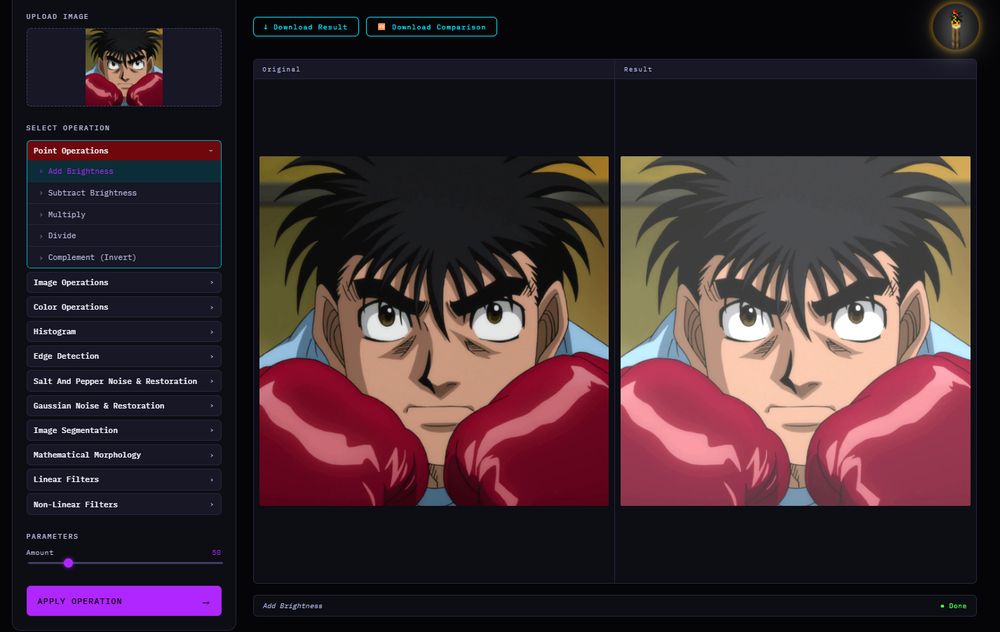
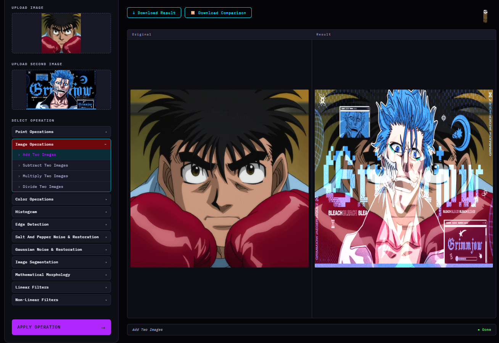
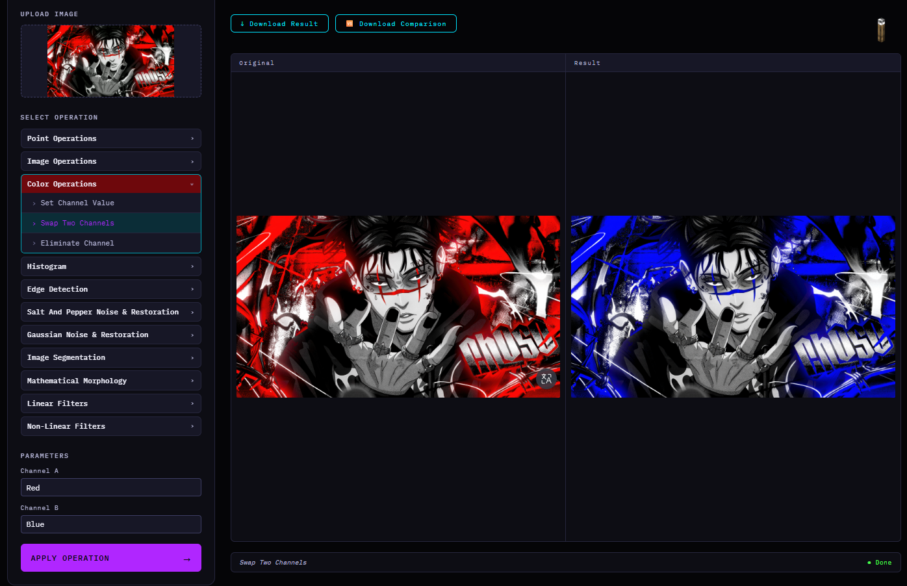
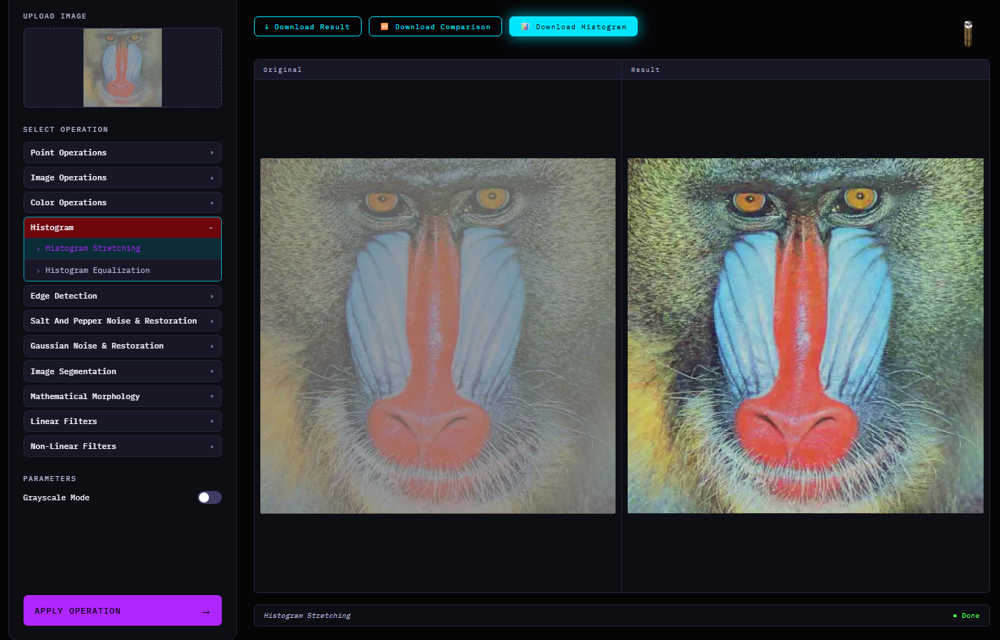
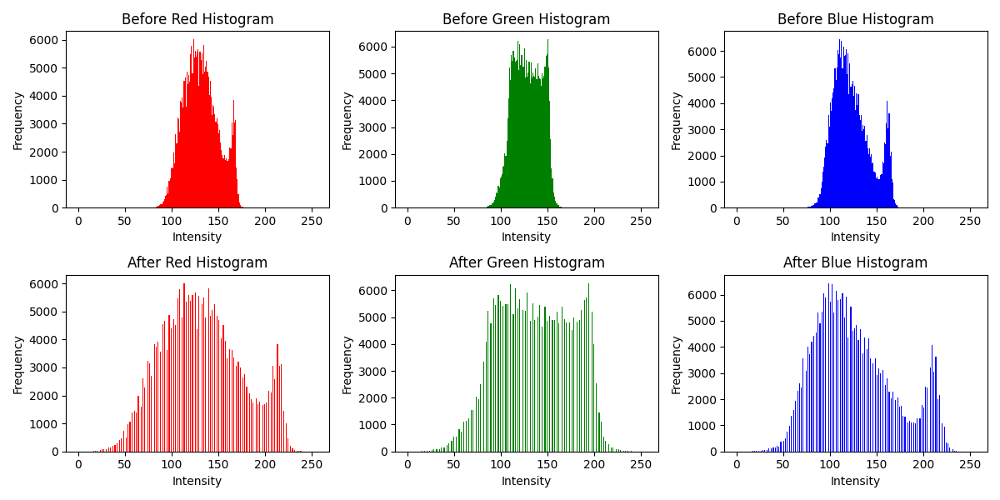
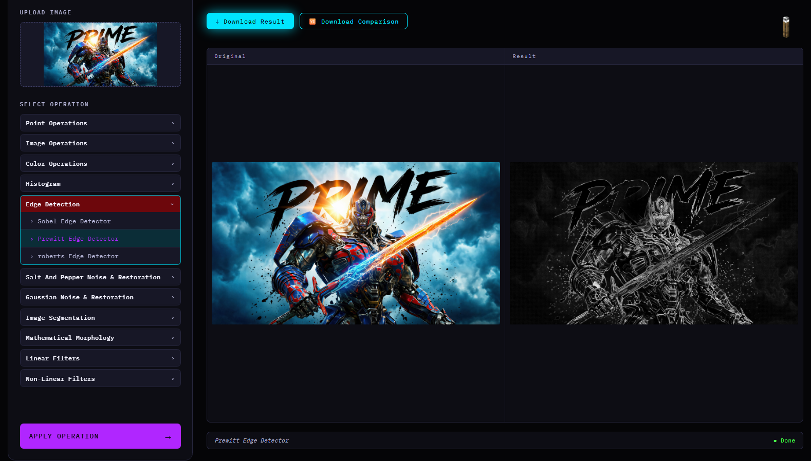
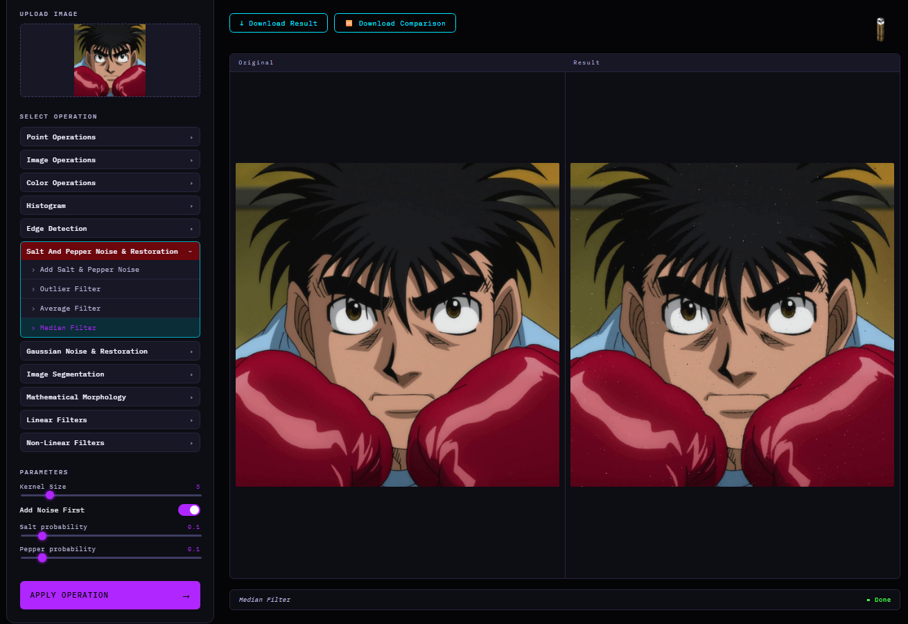
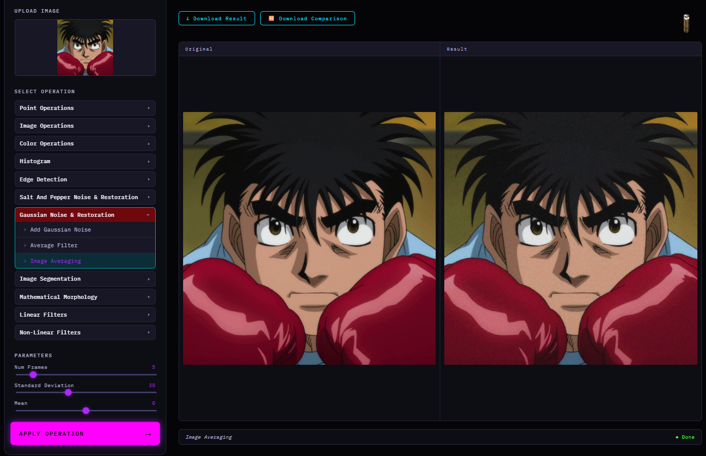
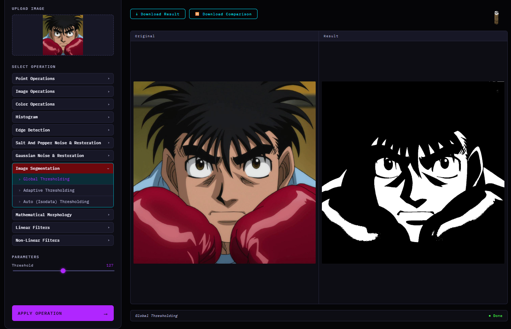
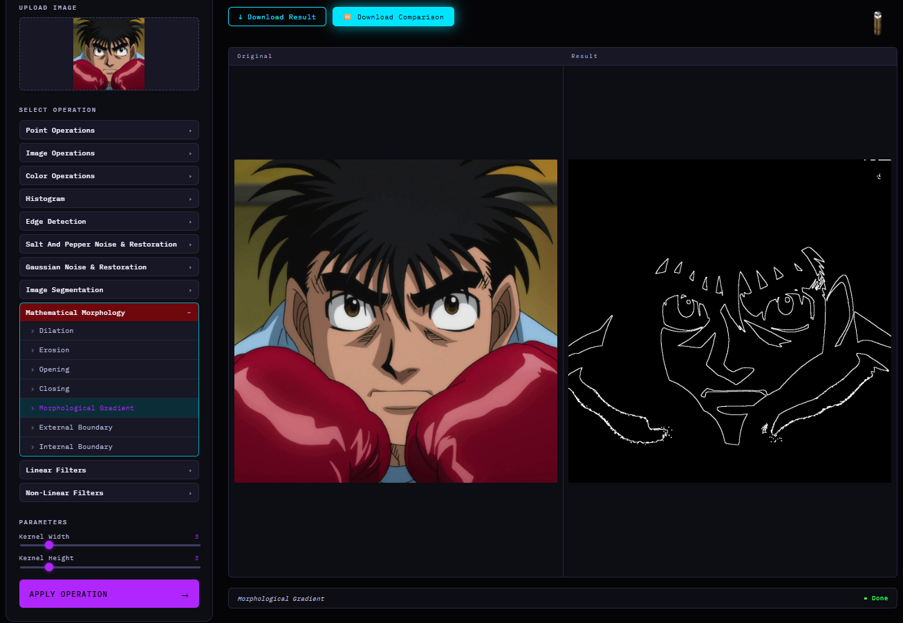

# Digital Image Processing Project
This project is a web application designed to apply various image processing tasks.
It uses Python (Flask) in the backend, HTML, CSS, and JavaScript in the frontend, and implements functionality using Python libraries such as NumPy and OpenCV. It also uses C++ to implement custom functions and improve performance, keeping the code fast and efficient.


## For Setup On Windows:

### Prerequisites:
#### Make sure you have installed:
- Python 3.10+
- pip
- C++ compiler (g++ / clang++)

### 1. Create The Virtual Environment(Optional but recommended):
Run this in terminal:
```bash
python -m venv venv
```
Then activate it:
```bash
venv\Scripts\activate
```
### 2. Install All Requirements:
Run this in terminal:
```bash
pip install -r requirements.txt
```
### 3. Run The Backend:
Run this in terminal:
```bash
python app.py
```
### 4. Open The Application:
Open your browser and go to: http://localhost:5000


## On Other Operating Systems:
You may encounter issues because the shared library file differs between operating systems. On Windows the shared library extension is `.dll`, on Linux `.so`, and on macOS `.dylib`.
You can fix this by running the following command inside the `modules` folder:
### in Linux:
```bash
g++ -fPIC -shared help.cpp -o help.so
```
Then, update your Python code inside the modules files:
```python
self.p = ctypes.CDLL(os.path.join(os.path.dirname(os.path.abspath(__file__)), "help.dll"))
```
To:
```python
self.p = ctypes.CDLL(os.path.join(os.path.dirname(os.path.abspath(__file__)), "help.so"))
```
### in MacOS:
```bash
clang++ -std=c++17 -dynamiclib help.cpp -o help.dylib
```
Then, update your Python code inside the modules files:
```python
self.p = ctypes.CDLL(os.path.join(os.path.dirname(os.path.abspath(__file__)), "help.dll"))
```
To:
```python
self.p = ctypes.CDLL(os.path.join(os.path.dirname(os.path.abspath(__file__)), "help.dylib"))
```
*Finally, you can delete help.dll since it is not needed on this operating system.*

## Operations:

### Arithmetic Operations:
#### These operations modify pixel intensity values using basic mathematical transformations.
- **Addition**: Increases image brightness by adding a constant to each pixel.
- **Subtraction**: Decreases image brightness.
- **Multiplication**: Scales pixel intensities to enhance brightness.
- **Division**: Reduces pixel intensities.
- **Complement**: Produces the negative version of the image.
#### *Example*


### Image Arithmetic Operations:
#### These operations apply arithmetic transformations between two images on a pixel-by-pixel basis. If the input images have different dimensions, the second image is automatically resized to match the first image.
- **Addition**: Combines two images by adding corresponding pixel values.
- **Subtraction**: Computes the difference between two images.
- **Multiplication**: Enhances or suppresses regions based on pixel interaction.
- **Division**: Highlights intensity differences between images.
- **Complement**: Produces the negative version of the image.
#### *Example*


### Color Channel Operations:
#### These operations manipulate individual color channels of an RGB image to modify color composition and visualize channel contributions.
- **Change Channel Value**: Sets all pixel values of a selected color channel to a constant value.
- **Swap Channels**: Exchanges two color channels (e.g., Red ↔ Blue).
- **Eliminate Channel**: Removes a channel by setting all its values to zero.
#### *Example*


### Histogram Operations:
#### Histogram-based operations are used to analyze and enhance image contrast by redistributing intensity values.
- **Histogram Stretching**: Expands the intensity range of an image to improve contrast.
- **Histogram Equalization**: Redistributes intensity values to produce a more uniform histogram and reveal hidden details.
#### *Example*



### Edge Detection Operations:
#### Edge detection is used to identify object boundaries and significant intensity changes in an image. These operations convert the image to grayscale and compute intensity gradients to highlight edges.
- **Sobel Operator**: Uses two 3×3 convolution kernels to compute horizontal and vertical gradients. It detects edges while providing slight smoothing, which helps reduce noise sensitivity.
- **Prewitt Operator**: Similar to Sobel, but uses simpler kernels with uniform weights. It estimates edge direction and magnitude based on intensity changes between neighboring pixels.
- **Roberts Operator**: Uses 2×2 kernels to compute diagonal gradients. It is computationally lightweight and detects sharp edges, but is more sensitive to noise.
#### *Example*


### Salt-and-Pepper Noise Processing:
#### Salt-and-pepper noise is a type of impulse noise where random pixels are replaced with extreme intensity values (black or white). This module supports adding noise artificially and applying different filtering techniques for noise removal.
- **Salt-and-Pepper Noise Addition**: Randomly replaces selected pixels with white (salt) or black (pepper) values to simulate impulse noise.
- **Outlier Filter**: Compares each pixel with the mean of its neighboring pixels. If the difference exceeds a threshold, the pixel is replaced by the local mean.
- **Average Filter**: Applies a mean kernel over neighboring pixels to smooth noise by averaging intensities.
- **Median Filter**: Replaces each pixel with the median value of its neighborhood. This is highly effective for salt-and-pepper noise because it removes outliers while preserving edges.
#### *Example*


### Gaussian Noise Processing:
#### Gaussian noise is a statistical noise model where pixel intensity values are disturbed by values sampled from a normal (Gaussian) distribution. This module supports adding Gaussian noise and applying noise reduction techniques.
- **Gaussian Noise Addition**: Adds random values sampled from a normal distribution with configurable mean and standard deviation.
- **Average Filter**: Reduces Gaussian noise by smoothing local intensity variations using neighborhood averaging.
- **Image Averaging**: Averages multiple noisy versions of the same image. Random noise tends to cancel out, improving image quality.
#### *Example*


### Thresholding Operations:
#### Thresholding is a segmentation technique used to separate foreground objects from the background by converting grayscale images into binary images.
- **Global Thresholding**: Uses a single threshold value for the entire image. Pixels above the threshold become white, while others become black.
- **Adaptive Thresholding**: Computes a local threshold for each neighborhood, making it effective for images with uneven illumination.
- **Automatic Thresholding**: Iteratively estimates the optimal threshold by partitioning pixels into two groups and updating the threshold using their mean intensities.
#### *Example*


### Morphological Operations:
#### Morphological operations are shape-based image processing techniques applied to binary images. They are commonly used for object refinement, noise removal, boundary extraction, and shape analysis.
- **Dilation**: Expands foreground regions by adding pixels to object boundaries, helping fill small holes and connect nearby objects.
- **Erosion**: Shrinks foreground regions by removing boundary pixels, useful for eliminating small noise.
- **Opening**: Applies erosion followed by dilation. It removes small noise while preserving larger structures.
- **Closing**: Applies dilation followed by erosion. It fills small holes and gaps inside objects.
- **Internal Boundary**: Extracts object boundaries from inside the object using: Internal Boundary = Original − Erosion
- **External Boundary**: Extracts outer boundaries using: External Boundary = Dilation − Original
- **Morphological Gradient**: Highlights full object boundaries using: Gradient = Dilation − Erosion
#### *Example*


